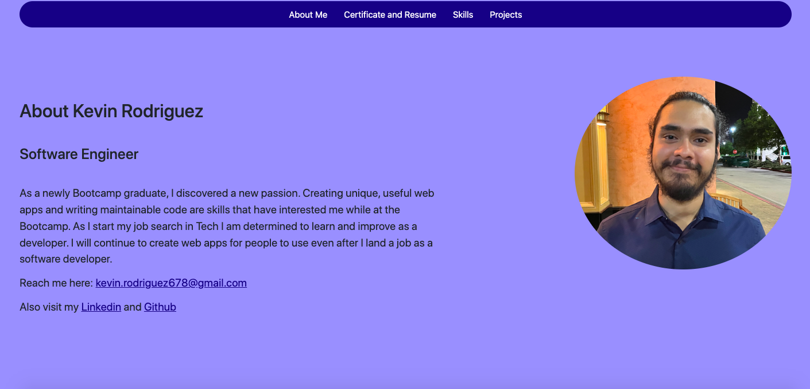

# Kevin's Coding Portfolio

---
This is my personal coding portfolio which contains three pages. Page one is about me, and page two contains my resume. Lastly page three will contain all of the projects I've worked on. It also has links to my personal Github and linkedin pages.
---
# [Visit my site here](kevins-code-portfolio.netlify.app)

Tech Used
---
- JavaScript
- CSS
- HTML

Credits
---
- All icons used for skills section are from (https://icons8.com/)